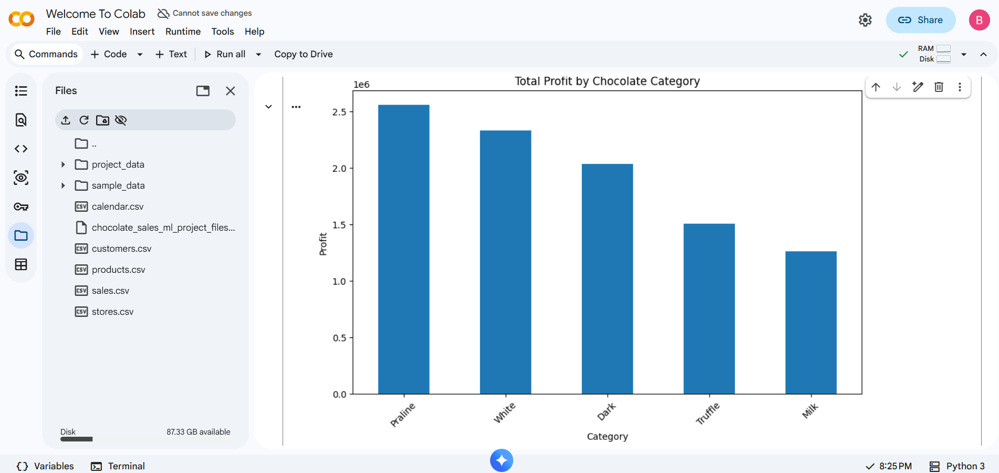
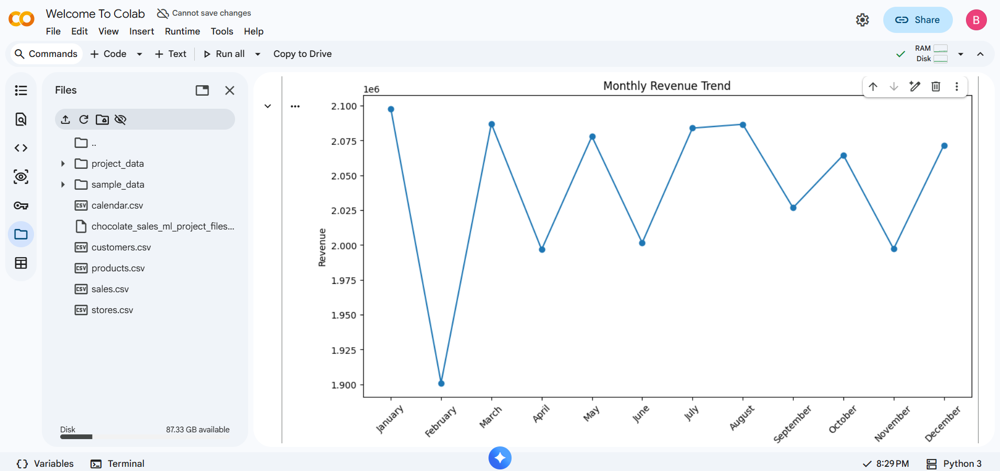
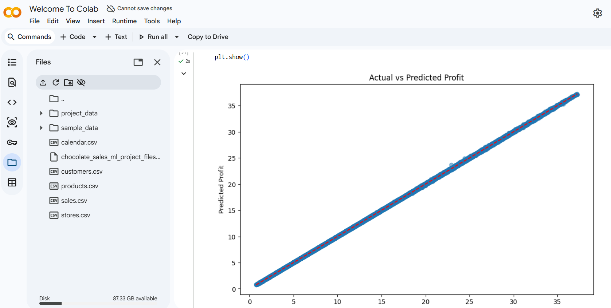

# Chocolate Sales Analysis and Profit Prediction using Machine Learning

## Project Overview

This project analyzes a large-scale chocolate sales dataset using Python and Machine Learning techniques. The objective is to identify business insights through data visualization and predict profit using a Decision Tree Regressor model.

## Technologies Used

* Python
* Pandas
* NumPy
* Matplotlib
* Seaborn
* Scikit-Learn
* Google Colab

## Dataset

The project uses five datasets:

* Sales
* Products
* Customers
* Stores
* Calendar

## Visualizations

* Bar Chart – Profit by Category
* Line Chart – Monthly Revenue Trend
* Pie Chart – Revenue Share by Category
* Scatter Plot – Revenue vs Profit
* Histogram – Profit Distribution

## Screenshots

### Profit by Category

### Monthly Revenue Trend

### Actual vs Predicted Profit

## Machine Learning Model

Model Used:

* Decision Tree Regressor

Performance:

* Mean Absolute Error (MAE): 0.0167
* R² Score: 0.99998

## Results

The model achieved excellent predictive performance and successfully identified important business insights from the sales data.

## Key Insights

- Identified the most profitable chocolate categories.
- Analyzed monthly revenue trends across multiple years.
- Examined revenue-profit relationships using correlation analysis.
- Visualized profit distribution patterns using histograms.
- Developed a machine learning model for profit prediction.

## Project Structure

├── Chocolate_Sales_ML_Project.ipynb

├── Chocolate_Sales_Analysis_Report.pdf

├── sales.csv

├── products.csv

├── customers.csv

├── stores.csv

├── calendar.csv

├── 01_bar_chart_profit_category.png

├── 02_line_chart_monthly_revenue.png

├── 03_pie_chart_revenue_share.png

├── 04_scatter_revenue_vs_profit.png

├── 05_histogram_profit_distribution.png

├── 06_model_results.png

├── 07_MAE & R² Output.png

└── 08_actual_vs_predicted.png

## Author

Komati Bhavya Sree
